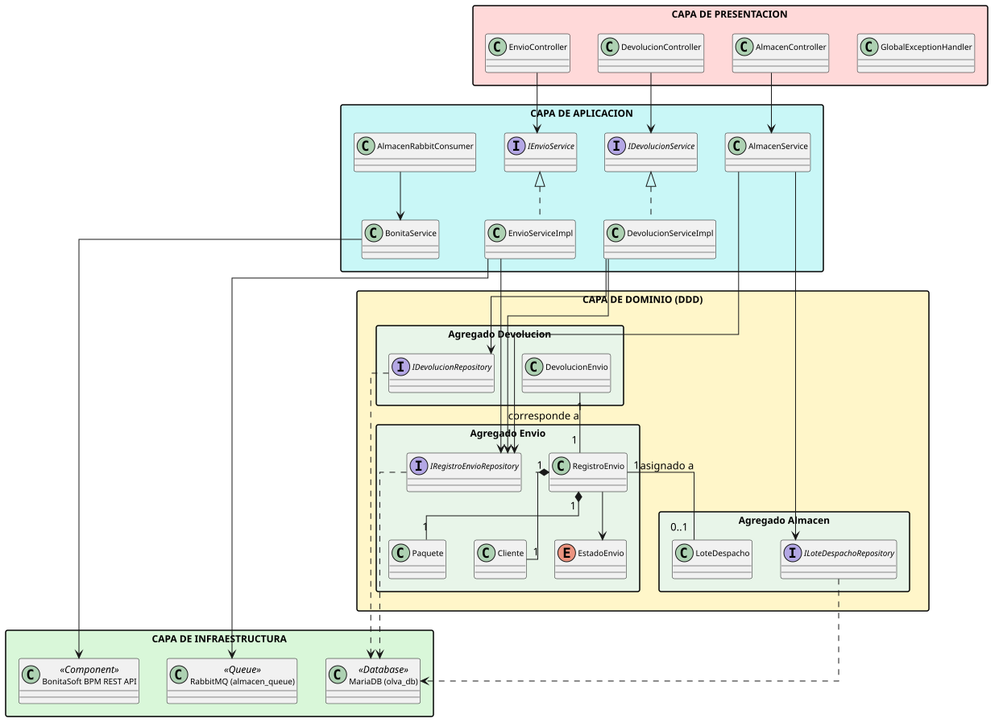
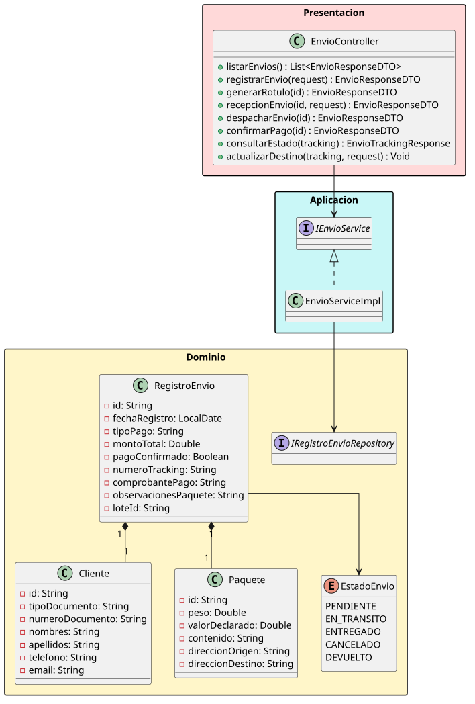
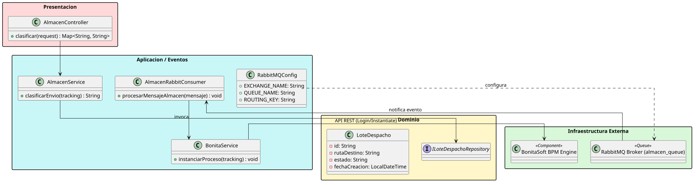
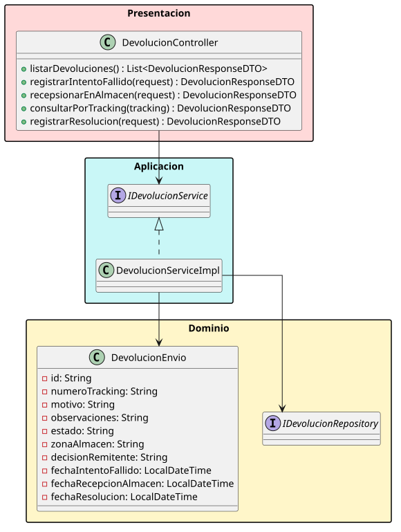

# Microservicios Backend - Sistema Olva Courier (Spring Boot)

## Equipo de Trabajo e Integrantes

- **Nombre del Equipo:** Equipo 5 - DSE
- **Integrantes:**
  - Calizaya Quispe, Jose Luis
  - Espinoza Barrios, David Alejandro
  - Hañari Cutipa, Cesar Alejandro
  - Miramira Bellido, Rimsky Augusto

---

## Propósito del Proyecto

El propósito de este proyecto es proveer un sistema backend robusto, escalable y mantenible mediante una API RESTful desarrollada con Spring Boot y Java 21 para la gestión logística de envíos, almacenamiento, clasificación y devoluciones de la empresa Olva Courier.

El sistema se integra de manera asíncrona mediante el broker de mensajes RabbitMQ y se comunica con la plataforma de gestión de procesos de negocio BonitaSoft BPM a través de servicios Web REST para automatizar los flujos operativos de clasificación y reenvío de paquetes.

---

## Visión General de Arquitectura: Domain-Driven Design (DDD)

La arquitectura del sistema sigue los principios de código limpio y separación en capas según Domain-Driven Design (DDD):

1. **Capa de Presentación (Presentation Layer):**
   Expone los puntos de entrada RESTful (`EnvioController`, `AlmacenController`, `DevolucionController`) que reciben las solicitudes del cliente web, la app móvil y las tareas automatizadas de BonitaSoft BPM. Incluye un manejador centralizado de excepciones (`GlobalExceptionHandler`) para retornar respuestas HTTP estandarizadas.

2. **Capa de Aplicación (Application Layer):**
   Coordina los casos de uso del negocio (`EnvioServiceImpl`, `AlmacenService`, `DevolucionServiceImpl`), la orquestación de eventos con RabbitMQ (`AlmacenRabbitConsumer`, `RabbitMQConfig`), y el cliente HTTP para la integración con BonitaSoft (`BonitaService`). Utiliza DTOs para el intercambio seguro de información.

3. **Capa de Dominio (Domain Layer):**
   Contiene las reglas centrales del negocio, entidades JPA (`RegistroEnvio`, `Paquete`, `Cliente`, `LoteDespacho`, `DevolucionEnvio`), enumeraciones (`EstadoEnvio`) y las abstracciones de repositorios (`IRegistroEnvioRepository`, `ILoteDespachoRepository`, `IDevolucionRepository`).

4. **Capa de Infraestructura (Infrastructure Layer):**
   Gestiona la persistencia de datos mediante Spring Data JPA y MariaDB, la mensajería asíncrona mediante RabbitMQ (`olva.logistica.exchange` y `almacen_queue`) y la integración remota con el motor BPM de BonitaSoft.

---

## Diagramas de Arquitectura y Dominio UML

El modelo del sistema ha sido estructurado y dividido en subdiagramas representativos para facilitar su comprensión:

### 1. Visión General de Arquitectura DDD



### 2. Módulo de Envíos



### 3. Módulo de Almacén, RabbitMQ e Integración BonitaSoft



### 4. Módulo de Devoluciones y Reenvíos



---

## Principales Servicios Web REST y Funcionalidades (OpenAPI / Swagger)

El sistema expone la documentación interactiva OpenAPI / Swagger en las siguientes rutas tras iniciar la aplicación:

- **Swagger UI:** `http://localhost:8081/swagger-ui.html`
- **OpenAPI JSON:** `http://localhost:8081/v3/api-docs`

A continuación se detallan los recursos principales y sus operaciones:

### 1. Recurso (Módulo): Envíos <Gestión del ciclo de vida del paquete>

- **Propósito:** Permite el registro de paquetes, cálculo de tarifas, emisión de comprobantes/rótulos de seguimiento, recepción en ventanilla, pagos, despachos y consulta pública del estado.
- **Operaciones Disponibles:**
  - `GET /api/envios`: Obtiene el listado completo de envíos registrados.
  - `POST /api/envios`: Registra una nueva orden de envío. Parámetro Cuerpo: `EnvioRequestDTO`.
  - `PUT /api/envios/{id}/generar-rotulo`: Genera el código de tracking único (OLVA-XXXXX) y número de boleta. Parámetro Ruta: `id` (String).
  - `PUT /api/envios/{id}/recepcion`: Registra las observaciones físicas y el método de pago recibido en la ventanilla. Parámetros: Ruta `id`, Cuerpo `RecepcionRequestDTO`.
  - `POST /api/envios/{id}/despachar`: Marca el paquete como despachado y publica un evento en RabbitMQ para notificar al almacén. Parámetro Ruta: `id` (String).
  - `PUT /api/envios/{id}/pago`: Confirma la verificación del pago de la orden. Parámetro Ruta: `id` (String).
  - `GET /api/envios/tracking/{tracking}`: Consulta pública de la ubicación y estado actual del paquete. Parámetro Ruta: `tracking` (String).
  - `PUT /api/envios/tracking/{tracking}/destino`: Actualiza la dirección de entrega del paquete en tránsito. Parámetros: Ruta `tracking`, Cuerpo `DestinoRequest`.
- **Modelos Clave:** Entidad `RegistroEnvio`, Entidad `Paquete`, Entidad `Cliente`, Enum `EstadoEnvio`.

### 2. Recurso (Módulo): Almacén <Clasificación de carga y disparo de flujos BPM>

- **Propósito:** Clasifica la carga recibida en lotes de distribución agrupados por ruta de destino y desencadena el proceso de negocio en BonitaSoft BPM.
- **Operaciones Disponibles:**
  - `POST /api/almacen/clasificar`: Clasifica el paquete según su ruta de destino y lo asigna a un lote de despacho abierto. Parámetro Cuerpo: `ClasificarRequest` (`numeroTracking`). Retorna: ID del lote asignado.
- **Modelos Clave:** Entidad `LoteDespacho`, Servicio `AlmacenService`, Consumidor `AlmacenRabbitConsumer`, Servicio `BonitaService`.

### 3. Recurso (Módulo): Devoluciones <Gestión de logística inversa y reenvíos>

- **Propósito:** Administra los paquetes cuyo intento de entrega fue fallido, gestionando su recepción en almacén central y la resolución final (reintento, devolución a origen o custodia).
- **Operaciones Disponibles:**
  - `GET /api/devoluciones`: Obtiene el listado completo de devoluciones registradas.
  - `POST /api/devoluciones/intento-fallido`: Registra un incidente o intento fallido de entrega reportado por el repartidor. Parámetro Cuerpo: `IntentoFallidoRequestDTO`.
  - `PUT /api/devoluciones/recepcion-almacen`: Registra el ingreso físico del paquete al almacén local y asigna la zona de custodia. Parámetro Cuerpo: `RecepcionAlmacenRequestDTO`.
  - `GET /api/devoluciones/{tracking}`: Consulta el expediente de devolución por su código de tracking. Parámetro Ruta: `tracking` (String).
  - `PUT /api/devoluciones/resolucion`: Registra la decisión tomada por el remitente o el sistema (REINTENTO, DEVOLUCION, CUSTODIA). Parámetro Cuerpo: `ResolucionDevolucionRequestDTO`.
- **Modelos Clave:** Entidad `DevolucionEnvio`, Servicio `IDevolucionService`, Repositorio `IDevolucionRepository`.

---

## Ejecución del Proyecto

1. **Requisitos previos:** Java 21, Maven 3.9+, MariaDB en puerto 3306 (BD: `olva_db`), RabbitMQ en puerto 5672.
2. **Compilar y ejecutar pruebas:**
   ```bash
   ./mvnw clean test
   ```
3. **Verificar calidad de código (Checkstyle):**
   ```bash
   ./mvnw checkstyle:check
   ```
4. **Ejecutar la aplicación:**
   ```bash
   ./mvnw spring-boot:run
   ```
