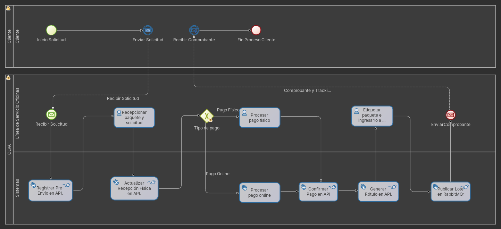
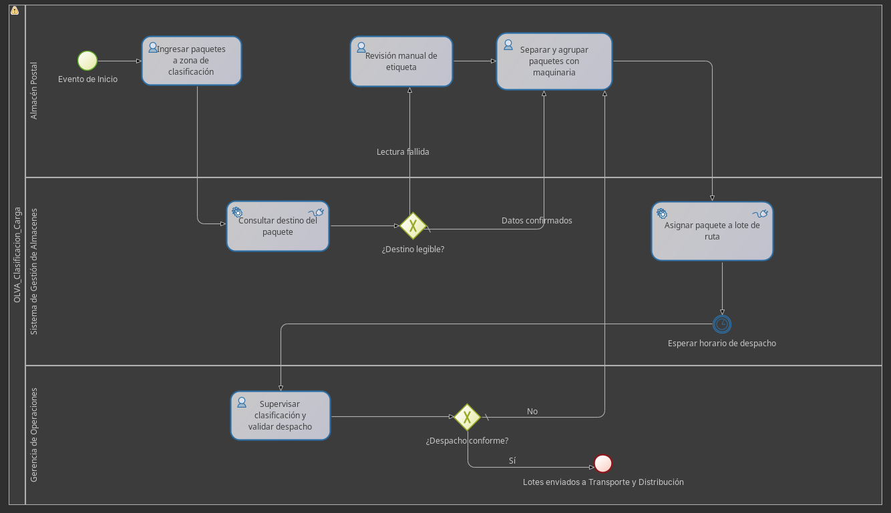

# Sistema de Gestion de Envios y Clasificacion de Carga - OLVA

Este repositorio contiene la implementacion del sistema core para la gestion de envios de OLVA, estructurado bajo una arquitectura orientada a procesos (BPM) y eventos. Integra una API REST en Spring Boot y procesos de negocio orquestados mediante BonitaSoft.

## 1. Descripcion de los Procesos

El sistema automatiza dos procesos misionales principales de la compania:

### Proceso 1: Registro y Recepcion de Envios

Maneja el flujo de interaccion con el cliente en la ventanilla, desde el pesaje del paquete, generacion del numero de tracking (rotulo) y el cobro (ya sea fisico o digital). Al finalizar exitosamente, el sistema despacha un evento informando que el paquete esta listo para ser clasificado.



### Proceso 2: Clasificacion de Carga (Almacen)

Inicia automaticamente de forma asincrona cuando llega un paquete despachado a la zona de clasificacion. Permite escanear paquetes, consultar su destino final y asignarlos dinamicamente a un Lote de Despacho (Ruta) mediante validaciones de sistema e inspeccion visual humana.



## 2. Arquitectura y Tecnologias

El sistema utiliza una arquitectura por capas en el backend y comunicacion asincrona para desacoplar el area de atencion al cliente del area logistica.

- **Lenguaje:** Java 21
- **Framework Backend:** Spring Boot 4.x
- **Motor BPM:** BonitaSoft Community Edition (2025.x)
- **Base de Datos:** MariaDB (Gestionada mediante Spring Data JPA / Hibernate)
- **Broker de Mensajeria:** RabbitMQ (Para comunicacion asincrona entre procesos)
- **Construccion:** Maven

## 3. Modelo de Dominio (Entidades Principales)

- `RegistroEnvio`: Entidad central que registra los estados logisticos (Tracking, estado, ubicacion).
- `Paquete`: Objeto de valor con las dimensiones y direccion de destino del envio.
- `Cliente`: Datos del remitente.
- `LoteDespacho`: Agrupacion de paquetes asignados a una misma ruta especifica.

## 4. Requisitos Previos (Dependencias)

Para ejecutar este proyecto en un entorno local, se requiere tener instalados y en ejecucion los siguientes servicios:

- JDK 21
- Maven 3.8+
- MariaDB Server (Puerto 3306)
- RabbitMQ Server (Puerto 5672)
- Bonita Studio o Bonita Tomcat Bundle en ejecucion (Puerto 8080)

## 5. Instrucciones de Ejecucion

### 5.1. Base de Datos y RabbitMQ

1. Asegurar que el servicio de MariaDB esta en ejecucion.
2. Crear una base de datos vacia llamada `olva_db`.
3. Iniciar el servicio local de RabbitMQ.

### 5.2. Despliegue en BonitaSoft

1. El proyecto completo de Bonita esta respaldado en `bonita/olva_project.bos`.
2. Abrir Bonita Studio, navegar a **Archivo > Importar** y seleccionar el archivo `.bos`.
3. Hacer clic en **Desplegar** para ambos diagramas (`RegistroRecepcionEnvios` y `ClasificacionCarga`).
4. (Opcional) Verificar que los puertos en `application.properties` correspondan con los de su instalacion de Bonita (por defecto 8080).

### 5.3. Ejecucion de la API REST (Spring Boot)

En la raiz del proyecto, ejecutar el siguiente comando:

```bash
mvn clean install
mvn spring-boot:run
```

La API de Spring Boot iniciara por defecto en el puerto `8081`.
Los controladores REST y el consumidor de RabbitMQ (encargado de iniciar el Proceso 2 automaticamente) comenzaran a operar inmediatamente.

## 6. Pruebas de API

El directorio `Pruebas de API` incluye colecciones exportadas (por ejemplo, Postman) con los endpoints de prueba, validaciones de negocio y flujos transaccionales.
